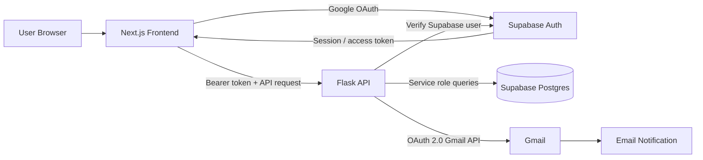

# TaskFlow — Hairdrama Tech Assignment

TaskFlow is a small task-management application built for the Hairdrama Tech internship assignment. Users sign in with Google, create and assign tasks, mark assigned tasks as complete, and receive Gmail notifications when a task is created or completed.

The code intentionally stays simple: the frontend handles presentation and authentication state, while the Flask API owns task rules, authorization checks, database access, and email notifications.

## Deployment status

- Frontend: https://hairdrama-task-manager-red.vercel.app
- Backend health: https://flask-api-production-499c.up.railway.app/health
- Repository: https://github.com/coderK1777/hairdrama-task-manager
- Database: Supabase project `qweubbwocnjilqjxlnqz`.

Both services are deployed and public HTTP checks pass. Production Google login
still needs its Supabase redirect configuration and a browser test. Gmail sender
configuration, two-account task tests, the follow-up permission migration, and
reviewer access checks are pending. See `DEPLOYMENT_STATUS.md` for the current checks.

## Features

- Google OAuth 2.0 login through Supabase Auth
- Automatic account/profile creation on first Google login
- Create a task and assign it to any registered user
- View tasks created by you or assigned to you
- Mark assigned tasks as completed
- Gmail API notification when a task is assigned
- Gmail API notification when a task is completed
- Responsive dashboard UI
- PostgreSQL schema and RLS policies in `/migrations`
- Separate production-ready frontend/backend deployment

## Technology

- **Frontend:** Next.js + TypeScript
- **Backend:** Flask (Python)
- **Database/Auth:** Supabase (PostgreSQL + Auth)
- **OAuth:** Google OAuth 2.0 via Supabase
- **Email:** Gmail API with OAuth 2.0
- **Deployment:** Vercel (frontend), Railway or Render (backend), Supabase (database/auth)

## Architecture



### Why this split?

The browser never receives the Supabase service-role key or Gmail refresh token. It only stores the normal Supabase user session. Every protected request includes the user's Supabase access token, and Flask verifies that token before applying business rules.

## Project Structure

```text
hairdrama-task-manager/
├── frontend/
│   ├── src/app/
│   │   ├── auth/callback/
│   │   ├── dashboard/
│   │   └── login/
│   ├── src/components/
│   ├── src/lib/
│   └── .env.example
├── backend/
│   ├── services/gmail_service.py
│   ├── scripts/generate_gmail_token.py
│   ├── app.py
│   ├── Procfile
│   ├── requirements.txt
│   └── .env.example
├── migrations/
│   └── 202609250001_initial_schema.sql
├── .env.example
├── .gitignore
└── README.md
```

## Database Model

### `profiles`

Stores the application-facing identity for a Supabase Auth user.

| Column | Purpose |
| --- | --- |
| `id` | Same UUID as `auth.users.id` |
| `email` | User's Google email |
| `full_name` | Display name from Google metadata |
| `avatar_url` | Google profile image |

### `tasks`

| Column | Purpose |
| --- | --- |
| `id` | Task UUID |
| `title` | Required title |
| `description` | Optional details |
| `status` | `pending` or `completed` |
| `creator_id` | User who created the task |
| `assignee_id` | User responsible for the task |
| `created_at` | Creation timestamp |
| `completed_at` | Set when task becomes completed |

## API Endpoints

| Method | Endpoint | Purpose |
| --- | --- | --- |
| `GET` | `/health` | Deployment health check |
| `POST` | `/api/profile/sync` | Sync Google profile into `profiles` |
| `GET` | `/api/profiles` | List users available for assignment |
| `GET` | `/api/tasks` | List tasks related to logged-in user |
| `POST` | `/api/tasks` | Create and assign a task |
| `PATCH` | `/api/tasks/:id/complete` | Mark a related task complete |

All `/api/*` routes require `Authorization: Bearer <supabase_access_token>`.

## Local Setup

### 1. Supabase

1. Create a Supabase project.
2. Open the SQL Editor and run the SQL files in `migrations/` in filename order.
   The first migration creates the schema. The second preserves rows and restricts
   writes to the server role, so browser clients cannot bypass Flask validation or
   Gmail notification logic. It also maintains profile update timestamps.
   Then run the read-only `scripts/verify_database.sql` to inspect constraints,
   indexes, triggers, RLS, grants, missing profiles, and task timestamps.
3. Copy your Project URL, anon/publishable key, and service-role secret.
4. Never put the service-role secret in the frontend.

### 2. Google login through Supabase

1. Create a Google Cloud project.
2. Configure the OAuth consent screen / Google Auth Platform audience.
3. Create a **Web application** OAuth client.
4. In Google Cloud, add the Supabase callback URL shown in Supabase's Google provider settings. It normally looks like:
   `https://YOUR_PROJECT_REF.supabase.co/auth/v1/callback`
5. In Supabase → Authentication → Providers → Google, enable Google and enter the web client ID and secret.
6. In Supabase Auth URL configuration, add both development and production frontend callback URLs, for example:
   - `http://localhost:3000/auth/callback`
   - `https://your-vercel-domain.vercel.app/auth/callback`

First Google login creates the Supabase Auth user; the database trigger creates the matching `profiles` row.

### 3. Gmail API sender

The app sends notification email from one application Gmail account. This keeps the assignment flow simple and avoids storing every user's Gmail credentials.

1. Enable **Gmail API** in the Google Cloud project.
2. Create a **Desktop application** OAuth client for the notification sender.
3. Put that client ID and secret in `backend/.env`.
4. Add the sender Google account as a test user if your OAuth app is still in testing.
5. Generate a refresh token:

```bash
cd backend
python -m venv .venv
# Windows: .venv\Scripts\activate
# macOS/Linux: source .venv/bin/activate
pip install -r requirements.txt
python scripts/generate_gmail_token.py
```

6. The helper saves `GMAIL_REFRESH_TOKEN` directly into the ignored `backend/.env`
   without printing it. Set `GMAIL_SENDER_EMAIL` to the account that granted consent.

The backend requests only the `gmail.send` scope.

### 4. Run the Flask API

```bash
cd backend
python -m venv .venv
# Windows: .venv\Scripts\activate
# macOS/Linux: source .venv/bin/activate
pip install -r requirements.txt
cp .env.example .env
python app.py
```

Backend: `http://localhost:5000`

Check: `http://localhost:5000/health`

### 5. Run Next.js

```bash
cd frontend
npm install
cp .env.example .env.local
npm run dev
```

Frontend: `http://localhost:3000`

## Environment Variables

### Frontend

```env
NEXT_PUBLIC_SUPABASE_URL=
NEXT_PUBLIC_SUPABASE_ANON_KEY=
NEXT_PUBLIC_API_URL=http://localhost:5000
```

Only values prefixed with `NEXT_PUBLIC_` are exposed to browser code. Do not place secret keys there.

### Backend

```env
SUPABASE_URL=
SUPABASE_SERVICE_ROLE_KEY=
FRONTEND_URL=http://localhost:3000
GMAIL_OAUTH_CLIENT_ID=
GMAIL_OAUTH_CLIENT_SECRET=
GMAIL_REFRESH_TOKEN=
GMAIL_SENDER_EMAIL=
```

## Deployment

### Frontend — Vercel

1. Push the repository to GitHub.
2. Import it into Vercel.
3. Set the project root directory to `frontend`.
4. Add the three frontend environment variables.
5. Deploy.

After deployment, copy the Vercel URL. You will use it for Supabase redirect configuration and backend CORS.

### Backend — Railway

1. Create a Railway project from the same GitHub repository.
2. Set the service root directory to `backend`.
3. Add all backend environment variables.
4. Set `FRONTEND_URL` to the Vercel production URL.
5. Use the checked-in `backend/railway.toml` start command and `/health` check.
   Gunicorn binds to `0.0.0.0:$PORT`; Railway supplies the port.
6. Generate a Railway public domain.
7. Update Vercel's `NEXT_PUBLIC_API_URL` with that Railway URL and redeploy the frontend.

The currently installed Railway CLI warns that `railway.toml` support ends on
December 1, 2026. Before that date, migrate the working service configuration with
`railway config migrate` and verify the generated infrastructure configuration.

### Final OAuth production setup

Add the final Vercel URL to Supabase Auth URL configuration, including:

```text
https://your-app.vercel.app/auth/callback
```

Then test Google login again in production.

## Authorization Rules

There are two layers:

1. **API authentication** — Flask verifies every Supabase access token using `supabase.auth.get_user(token)`.
2. **Business authorization** — task endpoints check whether the current user is the task creator or assignee before returning/updating data.

The database also has Row Level Security enabled as defense in depth.
After migration `202609250002_api_write_permissions.sql`, authenticated clients
have read access subject to RLS; only the backend service role can write.

## Verification

From `frontend`, run `npm ci`, `npm run lint`, and `npm run build`.
From `backend`, run `python -m unittest discover -s tests -v` after installing
requirements. These regression tests mock external services and do not replace
Google sign-in, database-trigger, or actual Gmail delivery tests.

## Email Flow

### New task

1. Creator sends `POST /api/tasks`.
2. Flask validates the assignee.
3. Flask inserts the task.
4. Flask calls Gmail API using the application sender's OAuth refresh token.
5. Assignee receives the new-task email.

### Completed task

1. Related user calls `PATCH /api/tasks/:id/complete`.
2. Flask verifies authorization.
3. Database updates task status and `completed_at`.
4. Flask sends a completion email to the task creator.

If Gmail temporarily fails, the task operation still succeeds and the API returns `email_sent: false`. This prevents an email outage from losing task data.

## Repository history

The supplied project folder did not contain a Git repository. Its initial commit
records the existing application and the deployment preparation together. Later
commits record subsequent changes as they happen; no development history is reconstructed.

## Loom Video Checklist

See `LOOM_WALKTHROUGH.md` for an eight-minute recording plan and
`INTERVIEW_NOTES.md` for a file-by-file explanation with practice questions.

Keep the video around the real request flow:

1. Show Google login.
2. Explain Supabase session/access token.
3. Show the migration and relationships.
4. Create a task for another user.
5. Show the Flask create-task endpoint.
6. Show the Gmail service and the received email.
7. Complete the task and show the completion email.
8. Explain why secrets are only in backend environment variables.
9. Show deployed Vercel/Railway URLs.
10. Briefly show GitHub structure and commit history.

## Technical Questions You Should Be Able to Answer

- Why use the Supabase user access token between Next.js and Flask?
- What is the difference between the anon key and service-role key?
- Why must the service-role key never be exposed in `NEXT_PUBLIC_*` variables?
- What does OAuth 2.0 do during Google login?
- What is a refresh token and why is it used for Gmail?
- Why use `gmail.send` instead of broader Gmail scopes?
- Why does task creation still succeed when email sending fails?
- Why are `creator_id` and `assignee_id` foreign keys?
- What does Row Level Security protect?
- Why verify authorization in Flask even with RLS enabled?
- Why is the frontend on Vercel and Flask on Railway?
- What does Gunicorn do in production?

## Small Improvements If Time Remains

Only add these after the required assignment works end-to-end:

- task due date
- priority
- search/filter
- pagination
- retry queue for failed emails
- unit/API tests
- optimistic UI updates

For the interview assignment, reliability and explainability are more valuable than adding many extra features.
